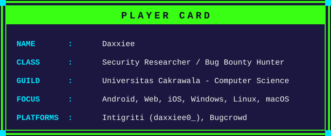
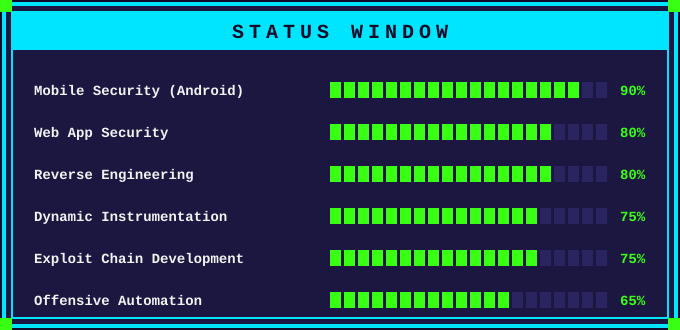

<div align="center">


<br><br>


</div>

<br>

<div align="center">



<br><br>



</div>

---

### 🎒 INVENTORY (Security Toolkit)

<p align="left">
  
  
  
  
  
  
  
  
  
</p>

**Skill tree:** Static analysis (JADX, APKTool, Smali), dynamic instrumentation (Frida/Objection hooking, overload resolution on obfuscated methods), deep link and intent exploitation, exported activity/provider/receiver abuse, WebView `addJavascriptInterface` and `loadUrl` auditing, Parcelable/Serializable abuse, OAuth/PKCE flow analysis, full taint flow tracing (source to sink to trust boundary).

---

### ⚔️ EQUIPPED WEAPONS (Tech Stack)

**Languages**
<p align="left">
  
  
  
  
</p>

**Frontend**
<p align="left">
  
</p>

**Database**
<p align="left">
  
</p>

**Hosting / Infra**
<p align="left">
  
  
</p>

**Automation / Research Tooling**
<p align="left">
  
  
</p>

---

### 🏆 QUEST LOG (Bug Bounty Highlights)

```
[QUEST] Okta Verify (Android) ............ Bugcrowd .... COMPLETE
  > Confirmed UriEnrollmentActivity deep link (oktaverify://)
    registered BROWSABLE without autoVerify, allowing any web
    page to trigger enrollment. Severity: P3

[QUEST] Capital.com (Android) ............ Intigriti ... COMPLETE
  > Found hardcoded UAEPass OAuth client secret in production
    APK, confirmed via live token retrieval. Discovered a
    secondary PKCE-absent authorization code interception
    chain, validated with a full Kotlin PoC

[QUEST] Dropbox (Android) ................ Intigriti ... COMPLETE
  > Exported FileCacheProvider vulnerability (CWE-284, CVSS
    6.8 High), validated with a full Kotlin PoC

[QUEST] Canva (Android) .................. Bugcrowd .... COMPLETE
  > Frida instrumentation research, including dynamic overload
    resolution for obfuscated methods
```

---

### 🛠️ CURRENT SIDE QUEST

```
> Building an Android Markdown notes app for the GitHub
  portfolio: editor, live preview, tags, and full-text search
  powered by Room FTS.
```

---

<div align="center">


</div>
